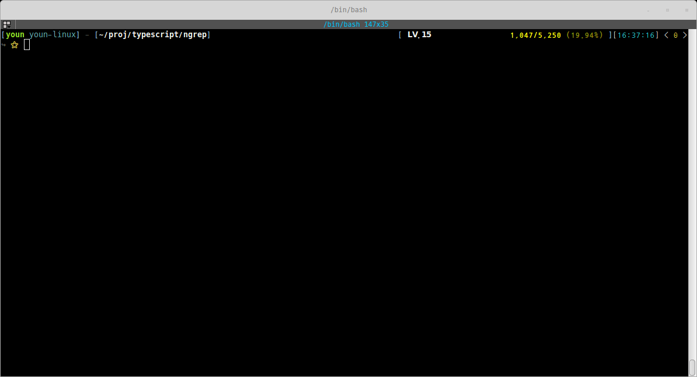
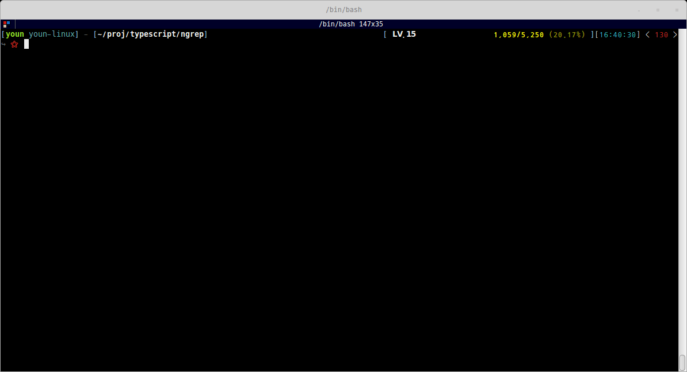

#  🇰🇷  ngrep

## Getting Started

First install ngrep:
``` bash
git clone https://github.com/mobbing/ngrep.git
cd ngrep
npm install
```

You should have [nodejs](https://nodejs.org/ko/download/package-manager/) at least 8.x.

## How to use

Help:
```
Usage: ngrep [search] [file] [options...]
       search: javascript regex pattern string for search.
       file:   file pattern javascript regex string
```

Default:
``` bash
ngrep console '.*js'
```


Stdin:
``` bash
cat ngrep.ts | ngrep console
```


Javascript Regex
``` bash
cat ngrep.ts | ngrep "con.*err.*\ {2}.*directory"
```


## License
[MIT](./LICENSE)


